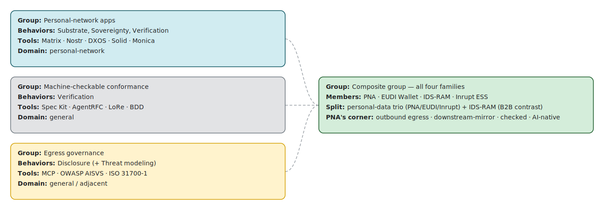

# Paper 1 — Figures (regenerated from the behaviour data)

> Source: `references.json` / `behaviour-matrix.md` (task wvye4lijn; conformance for EUDI/IDS-RAM corrected to *awarded*). Cell: ● strong · ◐ partial · · none.

## Figure 1 — Behaviour-family matrix: the three source clusters and the composite group

| Cluster | Reference | Substrate | Sovereignty | Verification | Disclosure | conformance | domain |
|---|---|:-:|:-:|:-:|:-:|---|---|
| Personal-network apps | Matrix Specification | ● | ● | ● | · | checked | direct-personal-network |
| Personal-network apps | Nostr protocol (NIPs) | ● | ● | ● | · | checked | direct-personal-network |
| Personal-network apps | DXOS Contacts example app on ECHO/ | ● | ● | ● | · | none | direct-personal-network |
| Personal-network apps | Solid Protocol (core + App-Interop | ● | ● | · | · | checked | adjacent-personal-data |
| Personal-network apps | Monica (open-source Personal Relat | ● | ● | · | · | none | direct-personal-network |
| Machine-checkable conformance | GitHub Spec Kit (constitution.md) | · | · | ● | ◐ | checked | general |
| Machine-checkable conformance | AgentRFC: Security Design Principl | · | ◐ | ● | ◐ | checked | distant |
| Machine-checkable conformance | LoRe: A Programming Model for Veri | ● | · | ● | · | checked | general |
| Egress governance | Model Context Protocol (MCP) Speci | ◐ | ◐ | ◐ | ● | mixed | general |
| Egress governance | OWASP AISVS (AI Security Verificat | · | ◐ | ◐ | ● | checked | general |
| Egress governance | AIUC-1 (AI Agent Security/Safety/R | · | ◐ | ◐ | ● | awarded | general |
| Egress governance | ISO 31700-1:2023 Privacy by Design | ◐ | ● | · | ● | awarded | adjacent-personal-data |
| **Composite** | **PNA toolkit** | ◐ | ● | ● | ● | **checked-not-awarded** | **direct-personal-network** |
| Composite | European Digital Identity (EUDI) W | ◐ | ● | ● | ● | awarded | adjacent-personal-data |
| Composite | Inrupt Enterprise Solid Server / D | ● | ● | ● | ◐ | none | adjacent-personal-data |
| Composite | International Data Spaces RAM 4.0  | ◐ | ● | ● | ● | awarded | general |

*The all-four-families cell is occupied by a **composite group** of ~4 (PNA, EUDI Wallet, IDS-RAM, Inrupt ESS), not by PNA alone. Three govern an **individual's** data (PNA's contacts, EUDI's credentials, Inrupt's pod) — the **personal-data trio** — while IDS-RAM governs **organizations'** data (the contrast case). They are differentiated fully in § 6; the sharpest axis is the **flavour of Disclosure** each governs (PNA = outbound egress · EUDI = credential presentation · IDS-RAM = usage-control-after-egress · Inrupt = inbound access grants).*

## Figure 2 — Positioning: three source clusters converge on a composite group

*Each source cluster supplies one or two of the four families; the composite group sits where all three converge. Within it, PNA holds the outbound-egress / downstream-mirror / checked-not-awarded / AI-native corner (§ 6).*

